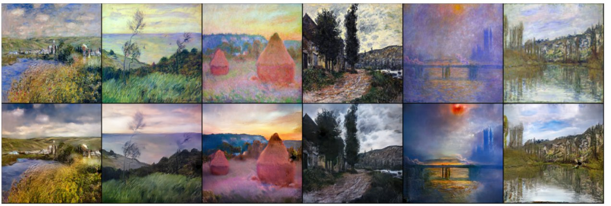
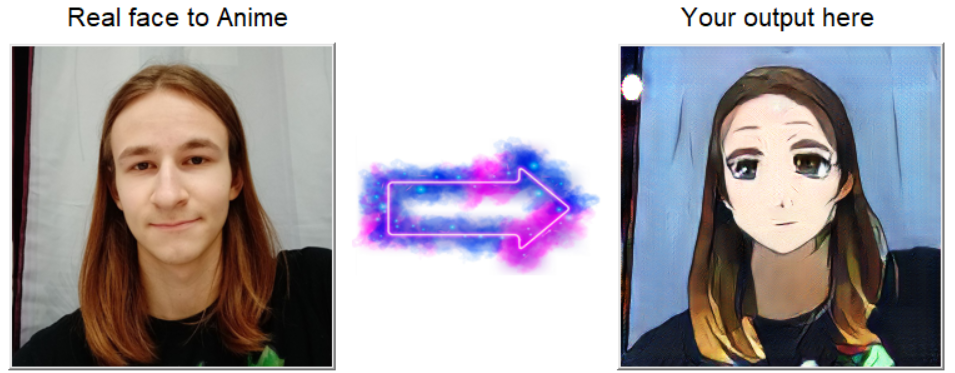
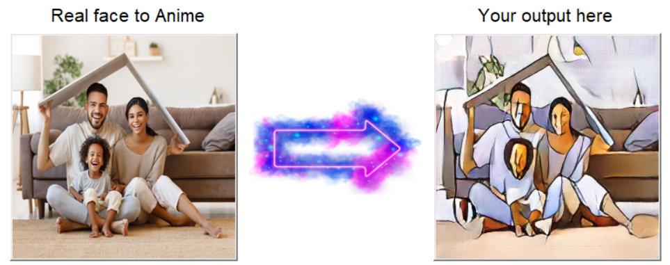
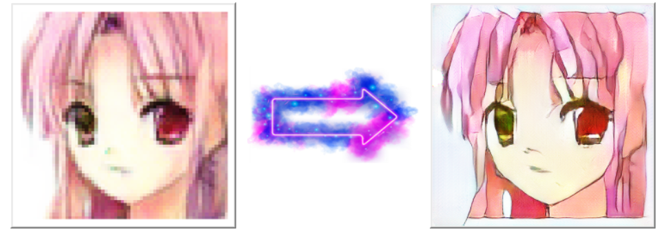

<p align="center">
	
	
  
  
</p>

# AniCycleGAN - CycleGAN implementation from scratch by Vaili Karol

### Project on generating and styling anime images using CycleGAN architecture

<p align="center">
	
</p>

## Table of contents:
* [Technical Information](#technical-info)
* [Getting Started](#startup)
* [Overall Results](#results)
* [GUI Overview](#gui)

<a name="technical-info"/>

## Technical Information

Tools used while creating the project:
* Python 3.10
* Jupyter notebook (kaggle GPU)

You can find all about basic libraries and modules used in the **REQUIREMENTS.txt** file.

<a name="startup"/>

## Getting Started

To play with network using GUI you can just run 'main.py' script file in the project directory using python (windows 10):
```
your\folder\with\main\file> python main.py
```
<a name="results"/>

## Overall Results

The whole work is based on "***Unpaired Image-to-Image Translation using Cycle-Consistent Adversarial Network 2017***" paper: (https://arxiv.org/pdf/1703.10593.pdf)

The implementation of the network started with the Monet2Photo task - to teach the network to translate photos into the style of Monet's paintings / make Monet's paintings photorealistic. 
Work process is described in the **cyclegan_demo.ipynb** notebook.

### *Monet to Photo results (cyclegan_demo)*:

<p align="center">
	
</p>

### *And vice versa*:


**The main task of A_CGAN** is to transform a real face into corresponding Japanese animation style face while preserving the original features.
The basic training process and architecture of the network is described in the **AniCycleGAN.ipynb** file.

The network was originally trained on the Flickr Faces dataset (https://www.kaggle.com/xhlulu/flickrfaceshq-dataset-nvidia-resized-256px). 
However, due to the variety of people's gender/age, as well as differences in their scale, the network was NOT able to correctly carry the style. 

After some researching, the selfie2anime dataset (https://www.kaggle.com/arnaud58/selfie2anime) was found to be perfect for the task.
Training was done using the kaggle platform's dedicated Nvidia Tesla K80 graphics card. Full training time took around **~30 hours**.

In the final version in 80% of cases the network successfully transfers the style, as well as in good lighting and photo rotation correctly detects the face and modifies it.
However, sometimes you can find non-critical artifacts in generated faces - white (sometimes black) 'spots'. In Monet2Photo this issue practically disappeared by the end of network training.

### *AniCycleGAN Results*:



### *With input image having small size faces, there is an usual style transfer, which can be used as well*:


### *Ani_CycleGAN network can also be used as a SuperResolution transformer for faces, that are Already anime*:




<a name="gui"/>

# GUI Overview
In conclusion, I would like to show you what all the work I have done turned out to be. A simple but quite functional GUI was created for processing and further saving an image. 
The application also has a brief instruction (the '?' button)


