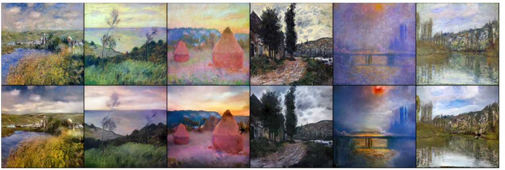
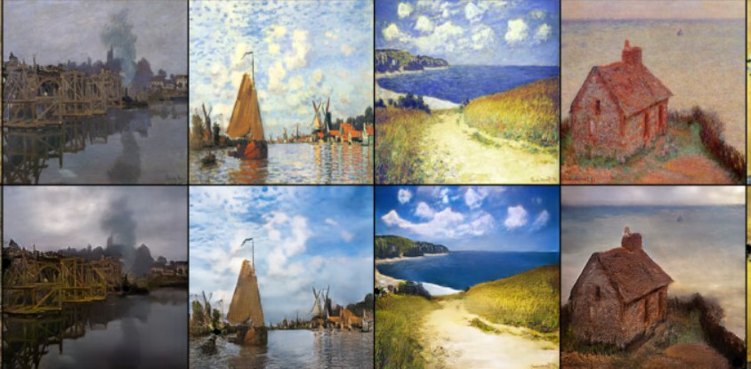
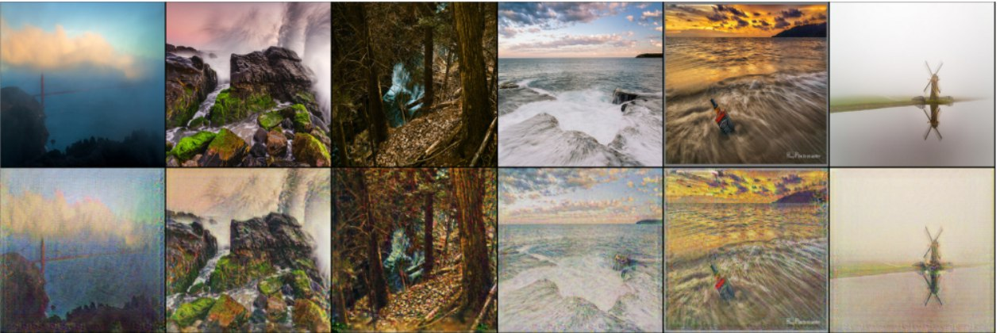
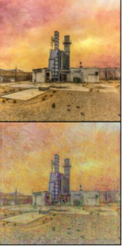
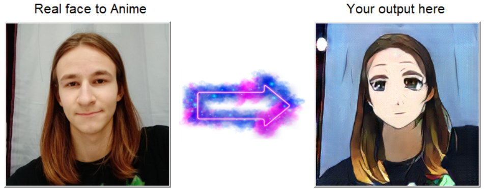
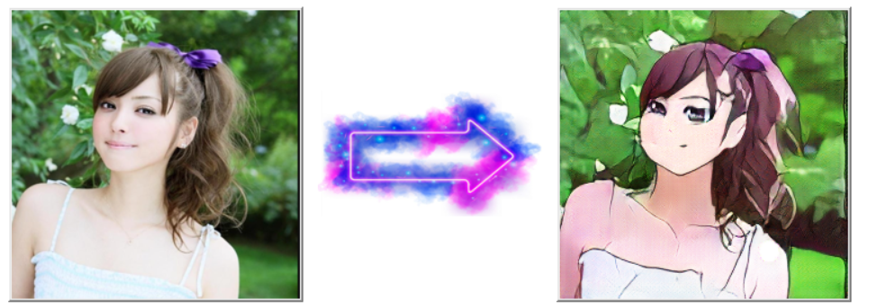
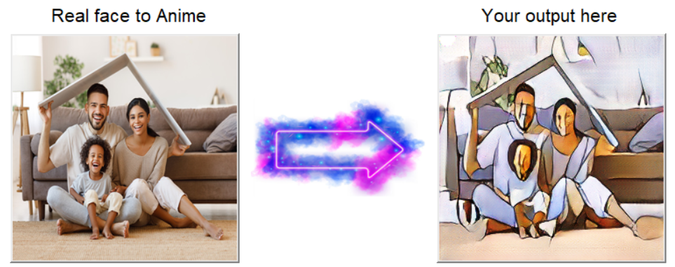
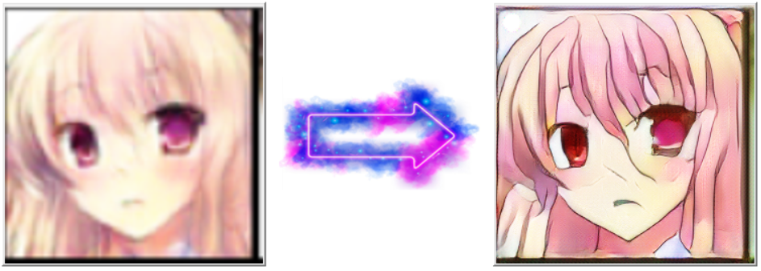
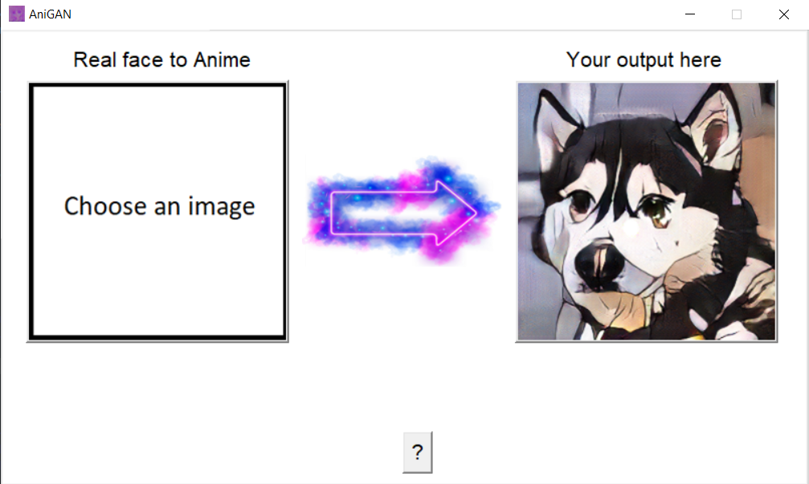

# AniCycleGAN - Финальный проект из курса Deep Learning School Василия Короля
### Проект по генерации и изменению стиля изображений при помощи CycleGAN архитектуры
## Оглавление:
* [Техническая информация](#тех-инф)
* [Использование](#запуск)
* [Результаты проделанной работы](#результаты)
* [Обзор GUI](#результаты)

<a name="тех-инф"/>

## Техническая информация

Для создания проекта были использованны:
* python 3.10
* jupyter notebook (kaggle)

Все библиотеки описаны в файле **REQUIREMENTS.txt**

<a name="запуск"/>

## Использование

Для запуска  GUI программы достаточно запустить файл main в директории проекта при помощи python (windows 10):
```
your\folder\with\main\file> python main.py
```
<a name="результаты"/>

## Результаты проделанной работы

За основу взята официальная статья "***Unpaired Image-to-Image Translation using Cycle-Consistent Adversarial Network 2017***" (https://arxiv.org/pdf/1703.10593.pdf)
Реализация сети началась с задачи Monet2Photo - научить сеть переносить фото в стиль картин Моне / делать картины Моне фотореалистичными. 
Данная работа описана в ноутбуке **cyclegan_demo.ipynb**

*Результаты cyclegan_demo Моне в Фото*:




*И наоборот*:




**Основная поставленная задача** - преобразование реального лица в соответствующие ему лицо в стиле японской анимации с сохранением первоначальных черт.
Основное обучение и архитектура сететй описана в файле **AniCycleGAN.ipynb**
Первоначально сеть тренировалась на датасете Flickr Faces (https://www.kaggle.com/xhlulu/flickrfaceshq-dataset-nvidia-resized-256px). 
Однако из-за разнообразия пола/возраста людей, а так же различия в их мастштабе сеть НЕ смогла правильно переносить стиль. 
После некоторых поисков был найжен идеально подходяший под задачу датасет selfie2anime (https://www.kaggle.com/arnaud58/selfie2anime)
Обучение проводилось при помощи выделенной платформой kaggle видеокарты Nvidia Tesla K80. Время полного обучения заняло ~30 часов.
В итоговом варианте в 80% случаев сеть успешно переносить стиль, а так же при хорошем освещении и повороте фотографии правильно детектирует лицо и видоизменяет его.
Из проблем можно выделить некритичные артефакты - белые (иногда черные) 'пятна' на итоговых изображениях. В работе Monet2Photo данная проблема практически пропала к концу обучения

*Результаты AniCycleGAN*:




*При маленьком размере лиц идет обычный перенос стиля, что так же может быть использованно*:


*Так же сеть может использоваться как SuperResolution для лиц стиля японской анимации*:



<a name="обзор"/>

# Обзор GUI
В заключении хочу показать то, во что вылелась вся проделанная работа. Был создан простой, но достаточно функциональный GUI для обработки и дальнейшего сохранения изображения изоюражения. 
В приложении также имеется краткая инструкция (кнопка '?')


